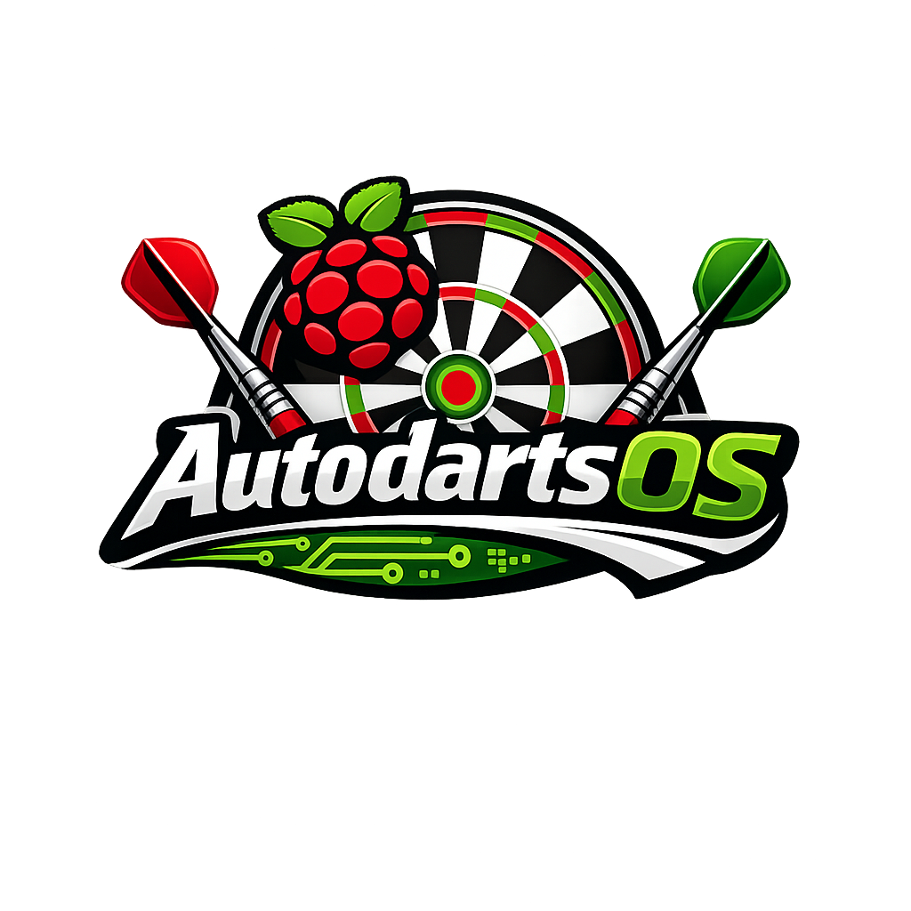

# Autodarts Pi OS



## Projekt Unterstuetzen

<a href="https://ko-fi.com/autodartsos">
  
</a>

Wenn dir Autodarts Pi OS hilft oder du die weitere Entwicklung unterstuetzen moechtest:

[Autodarts Pi OS auf Ko-fi unterstuetzen](https://ko-fi.com/autodartsos)

Autodarts Pi OS ist ein inoffizielles Raspberry-Pi-OS-Lite-Image fuer Autodarts-Setups. Es ist als kleines Appliance-System gedacht: Image flashen, Raspberry Pi starten, Netzwerk einrichten und die weitere Konfiguration ueber das lokale Webpanel oder den angeschlossenen Bildschirm vornehmen.

Ziel ist ein reproduzierbares Out-of-the-box-System fuer Raspberry-Pi-basierte Autodarts-Boards.

## Funktionen

- Raspberry Pi OS Lite als Basis
- Image-Build ueber `pi-gen`
- kein Raspberry-Pi-OS-Benutzerdialog beim ersten Start
- Raspberry-Pi-Imager-Unterstuetzung fuer Hostname, WLAN und SSH
- Setup-Hotspot, wenn noch kein Netzwerk verfuegbar ist
- lokales Webpanel fuer Setup, Status, Admin und Recovery
- Kiosk-Ausgabe auf angeschlossenem Monitor
- gebuendelter Autodarts-Installer mit SHA256-Pruefung im Release-Image
- direkter Einstieg in den Autodarts Manager und die Kamera-Konfiguration
- Recovery-Hotspot und Factory Reset
- Raspberry-Pi-Imager-Manifest fuer Releases

## Status

Autodarts Pi OS ist aktuell ein experimentelles, aber bereits nutzbares Appliance-Image. Getestet wurden unter anderem:

- WLAN-Uebergabe aus Raspberry Pi Imager
- Fallback in den Setup-Hotspot
- lokale Einrichtung ueber Kiosk
- Zugriff auf den Autodarts Manager ueber Port `3180`
- GitHub-Release-Download ueber Imager-Manifest
- Reboot-Verhalten nach erfolgreichem Setup

Das Projekt ist kein offizielles Autodarts-Projekt.

## Einrichtung Fuer Nutzer

### 1. Image flashen

Lade aus dem GitHub-Release das Image und die passende `.rpi-imager-manifest`-Datei herunter.

Wenn du WLAN, Hostname oder SSH direkt im Raspberry Pi Imager setzen willst, oeffne die `.rpi-imager-manifest`-Datei mit Raspberry Pi Imager und waehle danach `Autodarts Pi OS Lite` aus der Betriebssystemliste.

Wichtig: Wenn du nur `Use custom` nutzt und direkt die Image-Datei auswaehlst, kann der Imager das Image zwar schreiben, aber die Anpassungen fuer WLAN, Hostname und SSH koennen ausgegraut sein.

### 2. Optionale Imager-Anpassungen

Im Raspberry Pi Imager kannst du setzen:

- Hostname
- WLAN-Name und WLAN-Passwort
- Sprache/Region
- SSH

Autodarts Pi OS importiert diese Werte beim ersten Boot und deaktiviert danach den Raspberry-Pi-Imager-Erststart-Hook. Dadurch springt der Imager-Erststart nach einem Reboot nicht erneut in den Systemstart.

Aus Sicherheitsgruenden ist SSH im Beispiel-Build standardmaessig deaktiviert. Wenn SSH im Imager aktiviert wird, ist Passwort-SSH im Image deaktiviert und es sollten SSH-Keys verwendet werden.

### 3. Erster Start

Wenn die Netzwerkdaten stimmen, verbindet sich der Pi direkt mit deinem Netzwerk. Das Webpanel ist danach erreichbar unter:

```text
http://<hostname>.local
http://<pi-ip>
```

Der Standard-Hostname ist:

```text
autodarts-pi
```

Wenn kein funktionierendes Netzwerk vorhanden ist, startet der Setup-Hotspot:

```text
WLAN: Autodarts-Setup
Passwort: autodarts
Setup-Adresse: http://auto.setup.go
Fallback-IP: http://10.42.0.1
```

Fuer den einfachen Headless-Erststart ist das Erstpasswort `autodarts`. Beim Setup muss ein eigenes Admin-Passwort gesetzt werden. Dieses neue Passwort wird danach auch als Passwort fuer den Recovery-Hotspot verwendet. Wenn WLAN-Daten ueber den Raspberry Pi Imager gesetzt wurden, versucht das System zuerst diese Verbindung und startet den Hotspot nur als Fallback.

Falls ein Handy trotz verbundenem Hotspot keine Seite oeffnet, mobile Daten fuer die Einrichtung kurz deaktivieren oder das WLAN als Netzwerk ohne Internet akzeptieren.

### 4. Webpanel

Das Webpanel bietet:

- Uebersicht
- Kameras / Autodarts
- Kamera-Setup
- Autodarts Play
- Netzwerk-Setup
- Adminbereich
- Logs und Systemstatus
- Ko-fi-Link

Das Webpanel ist fuer lokale Netze gedacht. Zugriffe aus oeffentlichen IP-Bereichen werden standardmaessig abgewiesen. Stelle das Webpanel nicht per Router-Portfreigabe direkt ins Internet.

Das Webpanel nutzt bewusst lokales HTTP. Fuer `*.local` und den Setup-Hotspot waeren oeffentlich vertrauenswuerdige TLS-Zertifikate in der Praxis nicht sauber automatisierbar; selbstsignierte Zertifikate wuerden auf Handy und Kiosk Browser-Warnungen erzeugen und die Einrichtung komplizierter machen. Die Schutzlinie ist daher: nur lokales Netz, kein Portforwarding, Login, CSRF-Schutz und private IP-Filter.

Der lokale Autodarts Manager ist vorgesehen unter:

```text
http://<hostname>.local:3180
http://<pi-ip>:3180
```

Die Kamera-Konfiguration ist direkt erreichbar unter:

```text
http://<hostname>.local:3180/config
```

## Recovery Und Reset

Nach erfolgreichem Setup bleibt der Zustand `configured` erhalten. Ein spaeterer Internet- oder WLAN-Ausfall startet den Setup-Hotspot nicht automatisch neu. Das verhindert, dass ein bereits eingerichtetes Geraet bei einem Router- oder Providerproblem wieder in den Factory-Modus faellt.

Setup-Modus bewusst wieder aktivieren:

1. Im Adminbereich `Recovery-Hotspot starten` verwenden.
2. Oder auf der Boot-Partition eine leere Datei mit diesem Namen anlegen:

```text
autodarts-recovery
```

Factory Reset ausloesen:

1. Im Adminbereich den Factory Reset starten.
2. Oder auf der Boot-Partition eine leere Datei mit diesem Namen anlegen:

```text
autodarts-factory-reset
```

## Build Workflow

Der Release-Build laeuft auf einem Linux-System mit `pi-gen`, zum Beispiel unter `/opt/pi-gen`.

```bash
cd /opt/AutodartsOS
git pull origin main

export PI_GEN_DIR="/opt/pi-gen"
RELEASE_VERSION="v0.1.18" BUNDLE_AUTODARTS_INSTALLER=true ./tools/build-release.sh
```

Der Build erzeugt nur die Lite-Version des Appliance-Images.
Bei `BUNDLE_AUTODARTS_INSTALLER=true` wird der Autodarts-Installer ins Image gelegt und mit einer SHA256-Datei versehen. Das Zielgeraet fuehrt standardmaessig nur diesen geprueften Installer aus; ein Live-Download ist nur als bewusster Entwickler-Fallback ueber die Konfiguration vorgesehen.

## Image Pruefen

Vor jedem Release Image und Manifest pruefen:

```bash
VERSION="v0.1.18"
DEPLOY_DIR="/opt/pi-gen/deploy"
IMAGE_FILE="$(ls -t "$DEPLOY_DIR"/*AutodartsPiOS*lite*.img.xz | head -n 1)"
MANIFEST_FILE="${IMAGE_FILE%.xz}.rpi-imager-manifest"

/opt/AutodartsOS/tools/verify-deploy-image.sh "$IMAGE_FILE" "$MANIFEST_FILE"
```

Die Pruefung stellt sicher, dass Manifest, Hashes, entpackte Image-Groesse und FAT-Bootpartition zusammenpassen.

## GitHub Release Erstellen

Wenn die Pruefung gruen ist:

```bash
gh release create "$VERSION" \
  "$IMAGE_FILE" \
  "$MANIFEST_FILE" \
  --repo TCD-QuoteOne/AutodartsOS \
  --title "Autodarts Pi OS $VERSION" \
  --notes "Autodarts Pi OS Lite release with bundled Autodarts installer support."
```

Wenn das Release bereits existiert und die Dateien ersetzt werden sollen:

```bash
gh release upload "$VERSION" \
  "$IMAGE_FILE" \
  "$MANIFEST_FILE" \
  --repo TCD-QuoteOne/AutodartsOS \
  --clobber
```

## Lokale Validierung

Windows:

```powershell
powershell -ExecutionPolicy Bypass -File .\tools\validate.ps1
```

Linux:

```bash
./tools/validate.sh
```

## Projektstruktur

```text
assets/      Boot-Splash und visuelle Assets
docs/        Architektur, Installation, Hardware und Entwicklung
image/       pi-gen-Stage, Overlays und Default-Konfiguration
imager/      Hinweise fuer Raspberry Pi Imager
profiles/   Hardwareprofile
services/   systemd-Service-Dateien
tools/       Build-, Release- und Validierungsskripte
webpanel/    Hinweise zum lokalen Webpanel
```

## Wichtige Pfade Im Image

```text
/etc/autodarts-pi-os/config.toml
/var/lib/autodarts-pi-os/
/var/log/autodarts-firstboot.log
/var/log/autodarts-network.log
/var/log/autodarts-kiosk.log
/var/log/autodarts-install.log
```

## Hinweis Zum Namen

`Autodarts Pi OS` ist als beschreibender Projektname fuer ein inoffizielles Raspberry-Pi-Image fuer Autodarts-Setups gedacht. Vor groesserer oeffentlicher Kommunikation sollte die Branding- und Trademark-Situation mit dem Autodarts-Projekt geklaert werden.

## Lizenz

Apache-2.0. Siehe [LICENSE](LICENSE).
